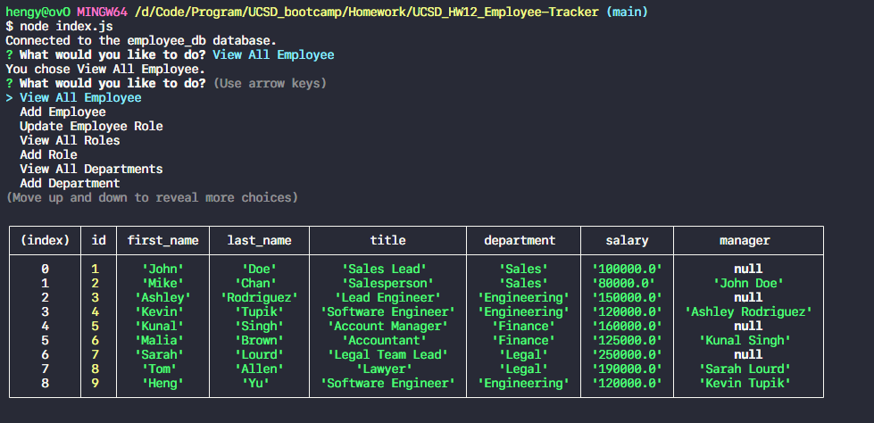

# UCSD_HW12_Employee-Tracker
Developers frequently have to create interfaces that allow non-developers to easily view and interact with information stored in databases. These interfaces are called content management systems (CMS). This program is to build a command-line application from scratch to manage a company's employee database, using Node.js, Inquirer, and MySQL.

## User History

```
AS A business owner
I WANT to be able to view and manage the departments, roles, and employees in my company
SO THAT I can organize and plan my business
```

## Related Links

* The Github Repository link: [My Github](https://github.com/hengyu89/UCSD_HW12_Employee-Tracker)

* The representation of thi Program: [Demo by Youtube](https://www.youtube.com/watch?v=AuQuqIFj8n0)

## Usage

* JavaScript
* Node.js
* Inquirer
* MySQL

## What I've done

* This program generate a menu that allows users to choose different options, in order to manage a company's employee database.

* The menu includes: Add Employee/Role/Department, View the table of Employee/Role/Department, Update the Role of a Employee, and Quit this program.

## Screenshot:

